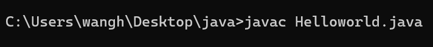
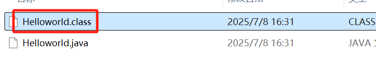
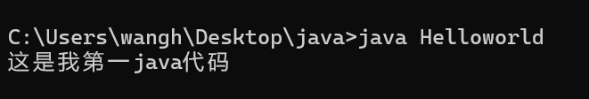

# 1.初学者开发三步骤

## 1.编写代码：
### a.创建一个后缀名为.java文件
### b.注意：可以把后缀显示出来查看
## 2.编译
### a.命令：javac java文件名.java
### b.注意：javac编译之后，会生成一个.class文件（字节码文件），jvm运行只认识.class文件
## 运行：
### a.命令：java class文件

### 执行编译命令后：生成.class文件

### 运行.class文件

